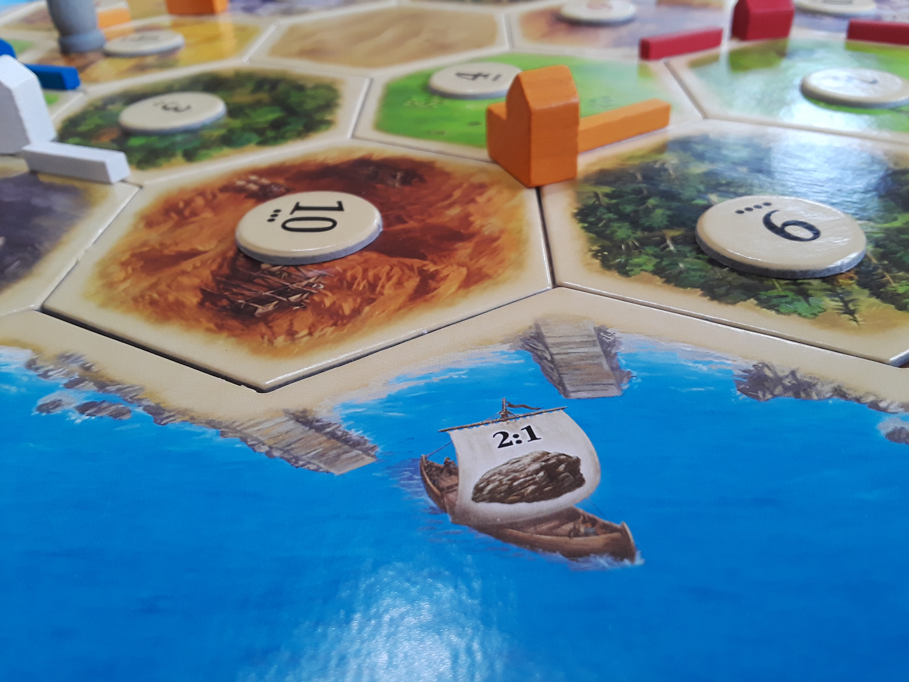

# Catan Stats

> A Place to track your in-game stats and historical data for your games of Catan

### Table of Contents

- [Description](#description)
- [Deploy the App](#Deploy)
- [Resources](#Resources)
    - [Application Controller](#Application)
    - [Sessions Controller](#Sessions)
    - [User Controller](#Users)
    - [Game Controller](#Games)
    - [Turn Controller](#Turns)
- [Contributing](#Contributing)
- [Code of Conduct](#Conduct)
- [Maintainers](#Maintainer(s))
- [License](#license)

---

## Description

This program was created to help people track the most commonly occurring dice rolls in a single game of Catan.
This web application allows a user to create a model representing a game of Catan, that allows a user to record the roll results of each turn. In progress and completed games can both be saved in a user's profile to be used for their own recording keeping.

With this instant knowledge on hand, you'll be able to make more strategic decisions in your games of Catan.

You can also use [the Catan Stats app here on Heroku.](https://catan-stats.herokuapp.com/)

### Technologies
- Ruby
- Sinatra
- Postgresql

## Deploy
---

To use Catan Stats, download a zipped file from Github (https://github.com/tmtarpinian/Catan_stats).
Please have ruby and the shotgun gem installed prior to running this application.

After unzipping and saving the contents to the desired directory, run `bundle install` to install all the gems required for this program.

From within that directory, run `shotgun` in your terminal, then open 'localhost:9393' in a web browser.

The program will run and prompt user to sign-up or login.

The close the program, logout of your account, exit your web browser, and type 'control + C' in your terminal to exit shotgun.

## Resources

### Application
| route | method | description | Docs |
|---|---|---|---|
|  '/' | GET | renders login page |  [code](./app/controllers/application_controller.rb#L12-L14) |
---

### Sessions
| route | method | description | Docs |
|---|---|---|---|
|  '/login' | GET, POST | renders login page |  [code](./app/controllers/sessions_controller.rb#L2-L13) |
|  '/logout' | GET | deletes session |  [code](./app/controllers/sessions_controller.rb#L15-L22) |
---

### Users
| route | methods | description | Docs |
|---|---|---|---|
|  '/signup' | GET, POST | creates instance of a user | [code](./app/controllers/users_controller.rb#L3-L15) |
|  '/profile' | GET | renders user dashboard | [code](./app/controllers/users_controller.rb#L17-L28) |
|  '/users/edit' | GET | renders edit user form | [code](./app/controllers/users_controller.rb#L30-L36) |
|  '/users' | PATCH, DELETE | Update, Delete current user | [code](./app/controllers/users_controller.rb#L38-L61) |
---
### Games
| route | methods | description | Docs |
|---|---|---|---|
|  '/games' | GET, POST | shows all games instances of logged in user and/or create new game instance |  [code](./app/controllers/games_controller.rb#L3-L13) |
|  '/games/new' | GET | renders form to create new game| [code](./app/controllers/games_controller.rb#L15-L21) |
|  '/games/:id' | GET, PATCH, DELETE | renders show page for particular game instance, and/or update/deletes instance of a game | [code](./app/controllers/games_controller.rb#L46-L91) |
|  '/games/:id/edit' | GET | renders form to edit a game instance |  [code](./app/controllers/games_controller.rb#L38-L61) |
---
### Turns
|  route | Methods | description  |  Docs |
|---|---|---|---|
|  '/games/:id/turns' | POST | creates instance of a turn within a game | [code](./app/controllers/turns_controller.rb#L3-L12) |
|  '/games/:game_id/turns/:id/edit' | GET | renders form for current turn in a game | [code](./app/controllers/turns_controller.rb#L14-L22) |
|  '/games/:game_id/turns/:id' | UPDATE, DELETE | current turn in a game | [code](./app/controllers/turns_controller.rb#L24-L44) |

## Contributing
---

Bug reports and pull requests are welcome on GitHub at https://github.com/tmtarpinian/Catan_stats. This project is intended to be a safe, welcoming space for collaboration, and contributors are expected to adhere to the [Contributor Covenant](http://contributor-covenant.org) code of conduct.

## Conduct
---

Everyone using and interacting in Catan Stat's codebases, issue trackers, chat rooms and/or mailing lists is expected to follow the [code of conduct](https://github.com/tmtarpinian/Catan_stats/blob/master/CODE_OF_CONDUCT.md).

## Maintainer(s)
---

|      |
| :------------- | 
|[@tmtarpinian](https://github.com/tmtarpinian) |

## License
Copyright © 2020 Trevor Tarpinian

The app is available as open source under the terms of the [MIT License](https://opensource.org/licenses/MIT).

